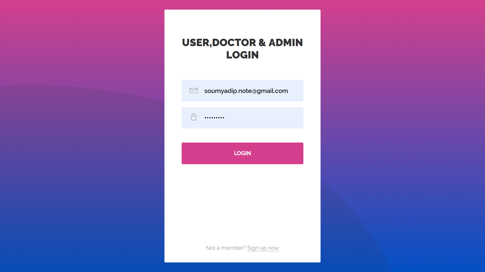
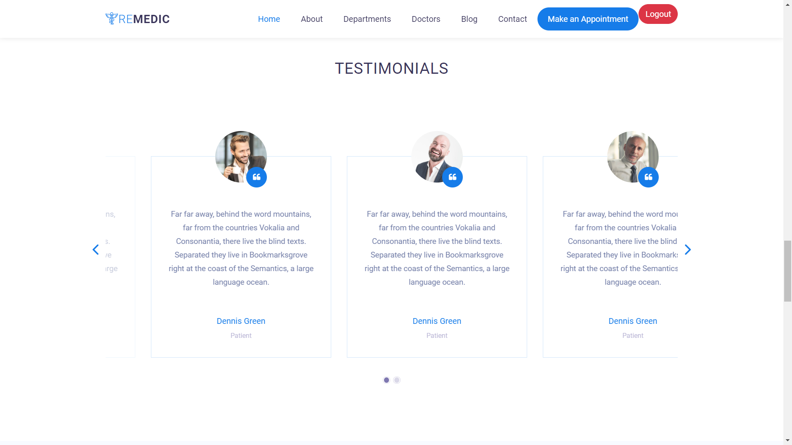
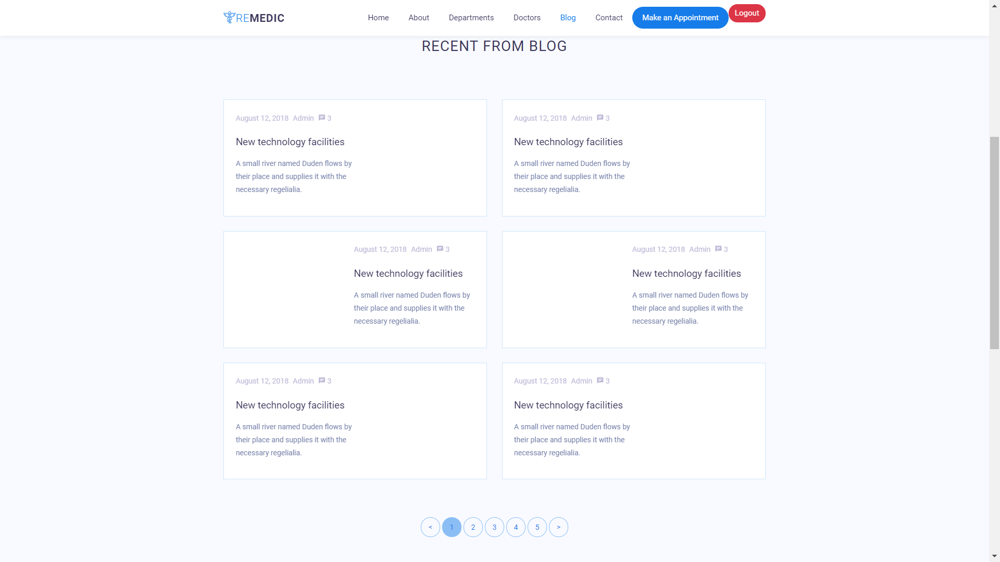
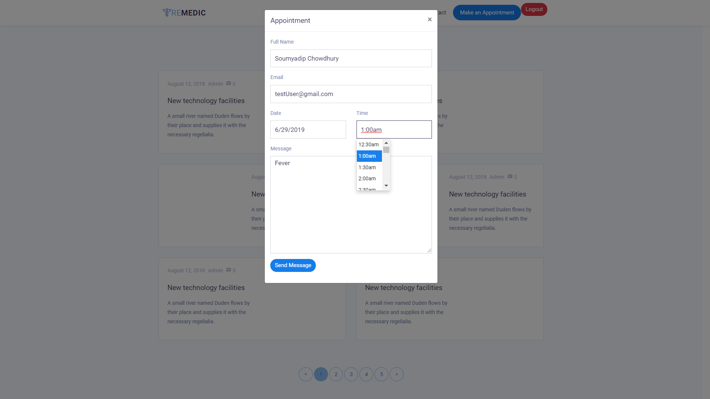
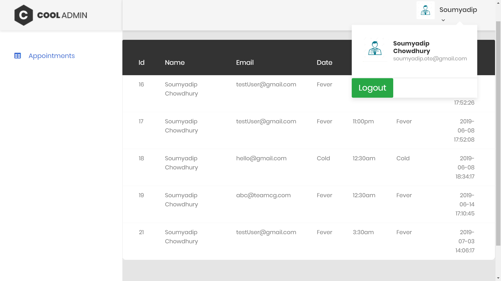
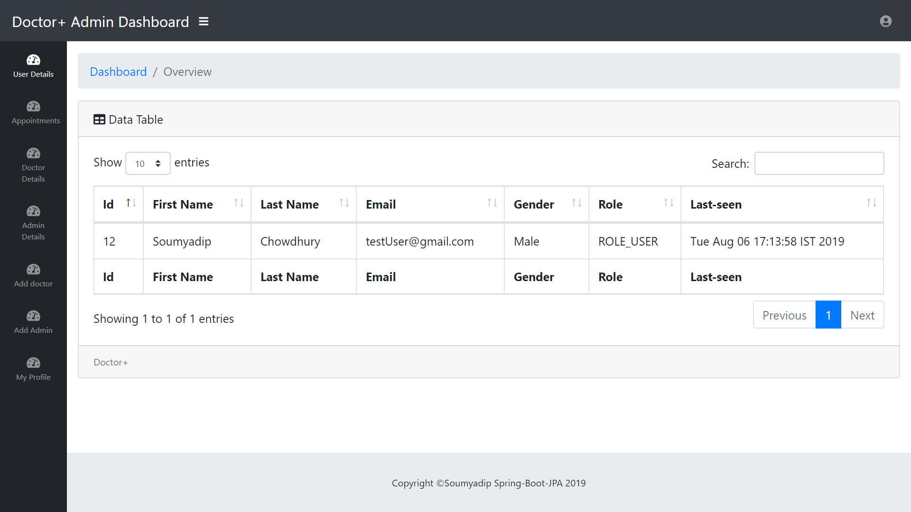
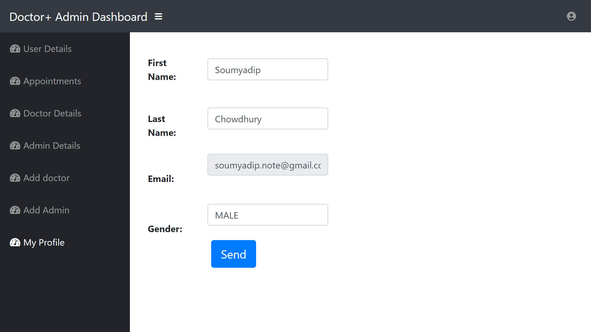

# E-Medical-System-Web-Project-Using-Spring-Boot-Security-JPA-Rest-Thymeleaf-HQL (HMS)
Project on Bio-Medical &amp; Hospital sector which is covering various field of this 3 sector.This project is using Spring Framework, Hibernate, JPA, Rest, JSP also with (Post-Dev Data-Science, Big-data, ML etc. ) [ for Hackathon, CSI &amp; SIH]

# Docker Integration

# Youtube Link : https://youtu.be/bGM6xkhz0cU

[](https://travis-ci.org/codecentric/springboot-sample-app)
[](https://coveralls.io/github/codecentric/springboot-sample-app?branch=master)
[](http://www.apache.org/licenses/LICENSE-2.0.html)


# Docker deployment 
## Requirements

For building and running the application you need:

- [JDK 1.8](http://www.oracle.com/technetwork/java/javase/downloads/jdk8-downloads-2133151.html)
- [Maven 3](https://maven.apache.org)

## Running the application locally

There are several ways to run a Spring Boot application on your local machine. One way is to execute the `main` method in the `com.medical.SpringMVC` class from your IDE.

Alternatively you can use the [Spring Boot Maven plugin](https://docs.spring.io/spring-boot/docs/current/reference/html/build-tool-plugins-maven-plugin.html) like so:

```shell
mvn spring-boot:run
```

## Deploying the application to OpenShift

The easiest way to deploy the sample application to OpenShift is to use the [OpenShift CLI](https://docs.openshift.org/latest/cli_reference/index.html):

```shell
oc new-app soumyadip007/E-Medical-System-Web-Project-Using-Spring-Boot-Security-MVC-Hibernate-JPA-Rest-Thymeleaf-HQL
```

This will create:

* An ImageStream called "springboot-maven3-centos"
* An ImageStream called "springboot-sample-app"
* A BuildConfig called "springboot-sample-app"
* DeploymentConfig called "springboot-sample-app"
* Service called "springboot-sample-app"

If you want to access the app from outside your OpenShift installation, you have to expose the springboot-sample-app service:

```shell
oc expose springboot-sample-app --hostname=www.example.com
```



# User Panel :








# Doctor Panel (Dashboard Access):




# Master Admin Panel (Dashboard Access):







## Copyright @soumyadip007
```shell
/**
 * 
 * @author Soumyadip Chowdhury
 * @github soumyadip007
 *
 */

```
Released under the Apache License 2.0. See the [LICENSE](https://github.com/codecentric/springboot-sample-app/blob/master/LICENSE) file.
# #Java Software (AWT/Swing/JavaFx/JDBC)

- [Java Swing 4 Projects Book selling system,Stadium Management,Chatbot etc](https://github.com/soumyadip007/Java-JavaFx-Swing-Projects-Desktop-Application-GUI-Software)

- [School Management System Software](https://github.com/soumyadip007/School-Management-System-GUI-Software-Using-Java-Swing-AWT-JDBC-JTatoo-MySql)

- [Java Swing Complete tutorial with example for JavaGuides.net](https://github.com/soumyadip007/Java-Swing-tutorials-and-examples-for-JavaGuides.net)


# #J2EE (JSP/Servlet/JSTL/JDBC Projects)

- [E-Market Place OLX-Clone](https://github.com/soumyadip007/E-Marketplace-for-buying-and-reselling-products-Web-Project-Using-JSP-Servlet-Jstl-Security-Jdbc)

- [Startup Company Live Website](https://soumyadip007.github.io/Coding_Liquids-StartUp-Company-Live-Website-Using-JSP-Servlet-JSTL-Security-JDBC-MD5-MySql-Bootstrap/)

- [Post-Disaster Management & Women Safety Project](https://github.com/soumyadip007/Post-Disaster-Management-and-Women-safety-Hackathon-JSP-Servlet-MySql-Bootstrap-GoogleMapApi-OSM)

- [Aim-India-Foundation-NGO-Live-Website](Aim-India-Foundation-WebDev-Internship-Using-Jsp-Servlet-Jstl-Jdbc-MySql-Bootstrap)

- *https://Lightningspeedmatchmaker.com* (in Private repo for security/commercial purposes,USA project)


# #Spring & Hibernte (Codes & Projects)

- [Spring-Core-XML-Data-Dependency-BeanScope-BeanLifecycle](https://github.com/soumyadip007/Spring-Core-XML-Data-Dependency-BeanScope-BeanLifecycle)

- [Spring-Core-Annotation](https://github.com/soumyadip007/Spring-Core-Annotation-BeanScope-BeanLifecycle)

- [Hibernate-ORM (All)](https://github.com/soumyadip007/Hibernate-ORM-Entity-Relations)

- [Spring-MVC-Request-Mapping-Validation](https://github.com/soumyadip007/Spring-MVC-Request-Mapping-Validation)

- [Customer-Tracker-CURD-Application-Using-Spring-MVC-Hibernate (Mini-Project)](https://github.com/soumyadip007/Customer-Tracker-CURD-Application-Using-Spring-MVC-Hibernate)

- [Spring-Security-User-Login-Authentication-Application-JDBC-Bcrypt](https://github.com/soumyadip007/Spring-Security-User-Login-Authentication-Application-JDBC-Bcrypt)

- [Spring-Security-Authentication-System-Registration-Login-with-OTP-Token-and-Email-verification (Mini Project)](https://github.com/soumyadip007/Spring-Security-Authentication-System-Reg-Login-with-OTP-Token-and-Email-verification)

- [SpringRest-Restfull-Webserices-Jackson-Json-Data-Binding-MVC](https://github.com/soumyadip007/Spring-Rest-Jackson-Json-Data-Binding)

- [Customer-Relationship-Management-Real-time-CURD-Application-using-Spring-Rest-Json-HQL-WebServices-MVC (Mini Project)](https://github.com/soumyadip007/Customer-Relationship-Management-Real-time-CURD-Application-using-Spring-Rest-Json-HQL-WebServices)

- [Spring-Boot-with-Restfull-Webservices-Json-Hibernate-JPA-Spring-Data](https://github.com/soumyadip007/Spring-Boot-with-Rest-Json-Hibernate-JPA-SpringDataJPA)

- [Employee-Relationship-CURD-Application-using-Spring-Boot-Thymeleaf-Hibernate-JPA-MVC (Mini Project)](https://github.com/soumyadip007/Employee-Relationship-CURD-Application-using-Spring-Boot-Thymeleaf-Hibernate-JPA-MVC)

- [E-Medical-System (Project)](https://github.com/soumyadip007/E-Medical-System-Web-Project-Using-Spring-Boot-Security-MVC-Hibernate-JPA-Rest-Thymeleaf-HQL)

- [SpringBoot-Angular8-Login-Registration](https://github.com/soumyadip007/SpringBoot-Angular8-Login-Registration-for-JavaGuides.net)

- *Pujo Direction* (Android/WEB(Spring Boot, MVC, REST, Security, Hibernate, JPA, Thymeleaf) http://pujodir.cloudjiffy.net/Pujo-Direction(App Store)) (in Private repo for security purposes)

# #Angular8 (Codes & Projects)

- [Angular8-Data-Event-Binding-Directives-Pipes-Form-Validation-Security-HTTP-Service-Routing](https://github.com/soumyadip007/Angular-8-Data-Event-Binding-Directives-Pipes-Form-Validation-Security-HTTP-Service-Routing)

- [Angular-Firebase-CURD-Application](https://github.com/soumyadip007/Angular-Firebase-CURD)

- [Angular8-Authentication-and-Authorization-JSON-JWT (Security)](https://github.com/soumyadip007/Angular-8-Authentication-and-Authorization-JSON-JWT)

- [Angular8 & Redux](https://github.com/soumyadip007/Angular-8-Redux)

- [Shopping-Cart-System-using-Angular-8-Auth-Module-Firebase (Mini Project)](https://github.com/soumyadip007/Shopping-Cart-System-using-Angular-8-Auth-Module-Firebase)

- [SpringBoot-Angular8-Login-Registration](https://github.com/soumyadip007/SpringBoot-Angular8-Login-Registration-for-JavaGuides.net)

# #Other Works

- [DBJ.jar (Framework for JDBC/On progress)](https://github.com/soumyadip007/DBJ.jar)

- [Ofline Route Builder & DTN (On progress)](https://github.com/soumyadip007/Offline-Route-Builder-DTN-Messenger-Android-GPS-OSM)

# #Wiki: https://github.com/soumyadip007/E-Medical-System-Web-Project-Using-Spring-Boot-Security-MVC-Hibernate-JPA-Rest-Thymeleaf-HQL/wiki
